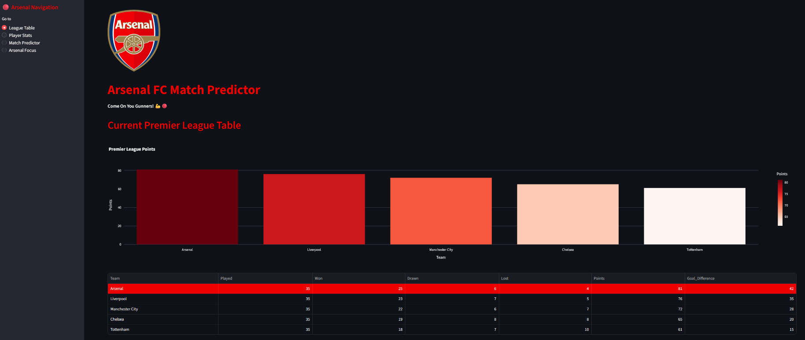
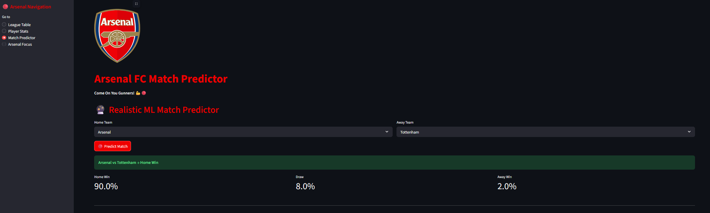
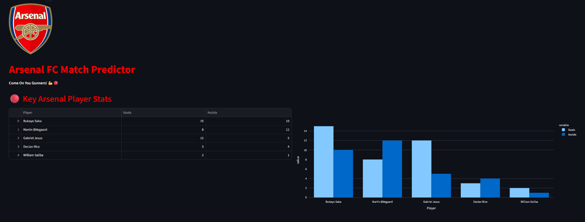

# ⚽ Arsenal FC Match Predictor


A complete **Premier League Match Predictor** with web scraping, Firestore database, Machine Learning, and an interactive Arsenal-themed dashboard.

## 🌐 Live Demo
**[→ View Live App](https://football-match-predictor-m8xc43djbwcubwov9xjla6.streamlit.app/)**  
*(Replace this with your actual Streamlit Cloud link)*

## Features

- Interactive Premier League Table with charts
- Realistic ML Match Predictor (Win/Draw probabilities)
- Arsenal Player Statistics
- Clean Arsenal Red & White theme
- Cloud Firestore integration
- Fully deployed on Streamlit Cloud

## Tech Stack

- **Frontend**: Streamlit + Plotly
- **ML Model**: Random Forest (scikit-learn)
- **Database**: Google Firestore
- **Language**: Python
- **Deployment**: Streamlit Cloud

## Screenshots

### League Table


### Match Predictor


### Player Stats


## Project Structure
football-match-predictor/
├── src/
│   ├── dashboard.py
│   ├── model.py
│   ├── scraper.py
│   └── firestore_utils.py
├── data/
├── models/
├── screenshots/
├── requirements.txt
└── README.md
text## How to Run Locally

```bash
git clone https://github.com/yourusername/football-match-predictor.git
cd football-match-predictor

python -m venv venv
venv\Scripts\activate     # Windows
# source venv/bin/activate # Mac/Linux

pip install -r requirements.txt
streamlit run src/dashboard.py